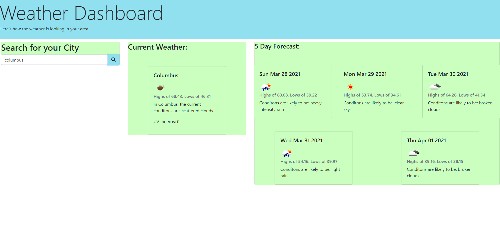

# Weather Dashboard

## Description

This is an interactive weather dashboard that allows users to type in & submit a city, and receive information 
about that city's current weather, as well as the forecasted weather for the next five days. The weather information 
is fetched from Open Map's API.

### Features

This web application also records & displays the user's previous city searches using local storage. The user
should also be able to see icons matching the weather descriptions.

### Visuals

### Links
[deployedApplication]   https://will98nicholson.github.io/WeatherApp/
